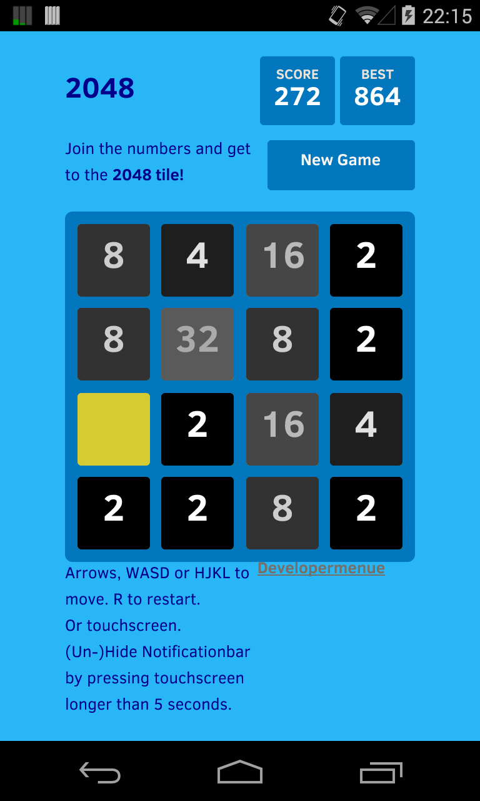

2048-android-modern
============
This fork is for incooperating google-play-services, highscorelists, sharing to fb, twitter, g+ and all that fancy new stuff :-)
Aaaaaaaaaand for adding fancy 8bit Tunes :-D

Original description
============

This is the android port of the 2048 game made by Gabriele Cirulli https://github.com/gabrielecirulli/2048 
It's nothing fancy, just a webview that loads the locally stored html files of the original game. 
I just wanted to make it instantly playable without Internet (the app doesn't require any permissions) and with 
a quick access icon for my smartphone.

Feel free to contribute with pull requests to the original project by Gabriele or to this one if you have any android 
specific improvements in mind. Original is at https://github.com/uberspot/2048-android

Play store link: https://play.google.com/store/apps/details?id=com.dlka.forked.dlka.forked.uberspot.a2048

##Building
    
### With Eclipse

1. Copy `https://github.com/The1andONLYdave/2048-blue.git` to clipboard
2. File -> Import -> Git / Projects from Git -> Clone URI
3. Paste URI from clipboard (if it did not appeared automatically)
4. Next> Next> 
5. Next> select "Import existing project"       

##License

2048-blue is licensed under the [MIT license.](https://github.com/The1andONLYdave/2048-blue/blob/master/LICENSE)
